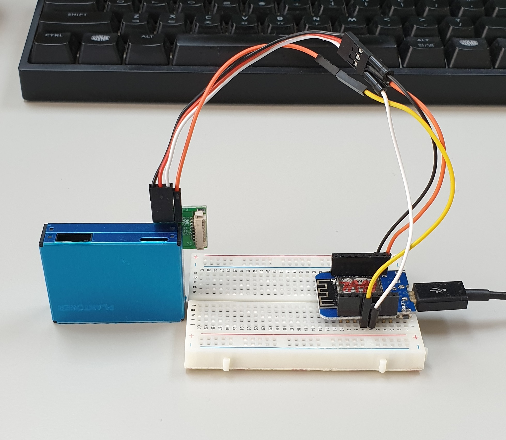
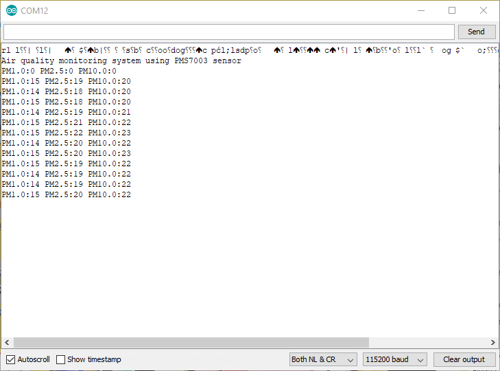

# IoT_tutorial

Tutorials for various IoT projects using ESP8266, Wemods D1 mini, ESP32, etc.

**Air quality monitor**

Project name : wemos_PMS7003

The aim of this project is to use PMS7003 sensor without 3rd party library and allow delay in loop. It also shows how to communicate with sensor via software serial.

 - Features : 
   1. Run without 3rd party library
   2. Allow delay function
 - Hardware : Wemos D1 mini, PMS7003
 - Software : Arduino IDE

**Air quality monitor with WIFI**

Project name : wemos_PMS7003_WIFI

The aim of this project is to demonstrate how to use Google Chart to visualize data and transmit data to cloud

 - Google Chart
 - thingspeak
 
 **Air quality monitor with WIFI, MQTT**

Project name : wemos_PMS7003_WIFI_MQTT

The aim of this project is to demonstrate how to use MQTT

 - io.adafruit.com: Free MQTT broker
 
 
